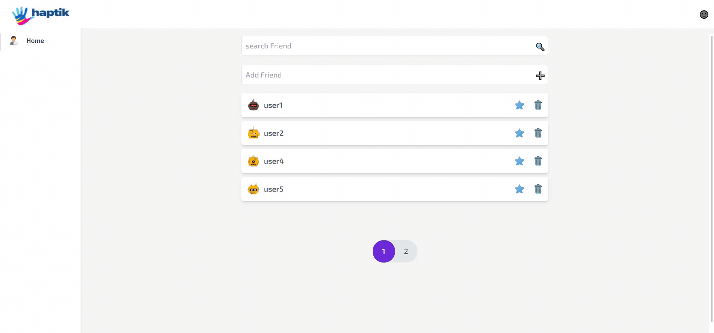
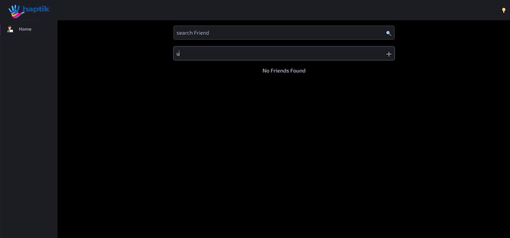
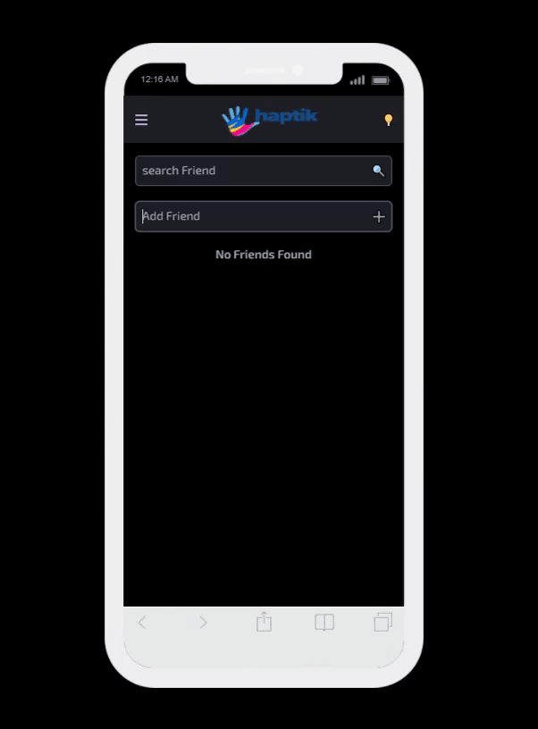

# 👤 Contact-app

> Designed and implemented a production ready application for displaying list of Objects for apartment

> Technology used: `React 17`, `Tailwind CSS`

# 🚀 [Live-Demo](https://fayez-haptik.web.app/)

---

## Table of Contents

- [Installation](#installation)
- [Features](#features)
- [Screencasts](#screencasts)
- [BrowserList](#browserlist)

---

## Installation

> To proceed with smooth installation you should have Node LTS version installed in your system

> Please navigate to project folder folder and run below command to install `node_modules` in order to run this app locally.

```shell
$ npm install
```

> Once node dependencies are installed then please open your terminal and run `npm start` for a development server.
> Navigate to `http://localhost:3000/`.
> The app will automatically launch if you change any of the source files.
> Alternatively, Please have a look on [Live-Demo](https://fayez-haptik.web.app/)

---

## 🔥 Features

> Expected functionality:

- Add new ‘friend’ in the list with the name typed in input on ENTER.
- search bar for searching friends in this current design.
- Favourite & Delete button functionality. Users should be able to sort the list with
  favourites on top.
- Add pagination support to the list when there are more than 4 entries.
- Dark 🌚 & Light 🌜 Mode

## 📸 Screencasts

### Dark 🌚 & Light 🌜 Mode - Mobile



---

### Home Page



### Home Page - Mobile



---

## 🌎 BrowserList

#### Best user experience can be enjoyed on:

- Google Chrome
- Mozilla Firefox
- Safari
- Microsoft Edge

---
